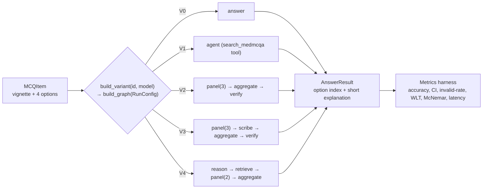
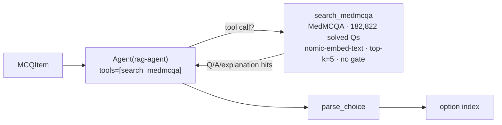
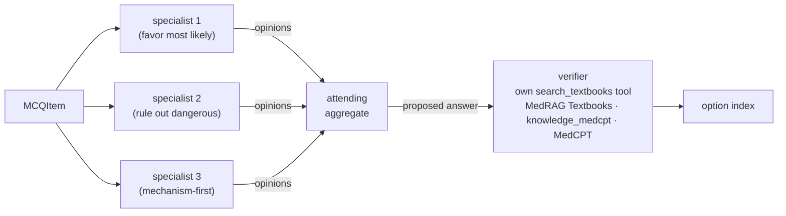
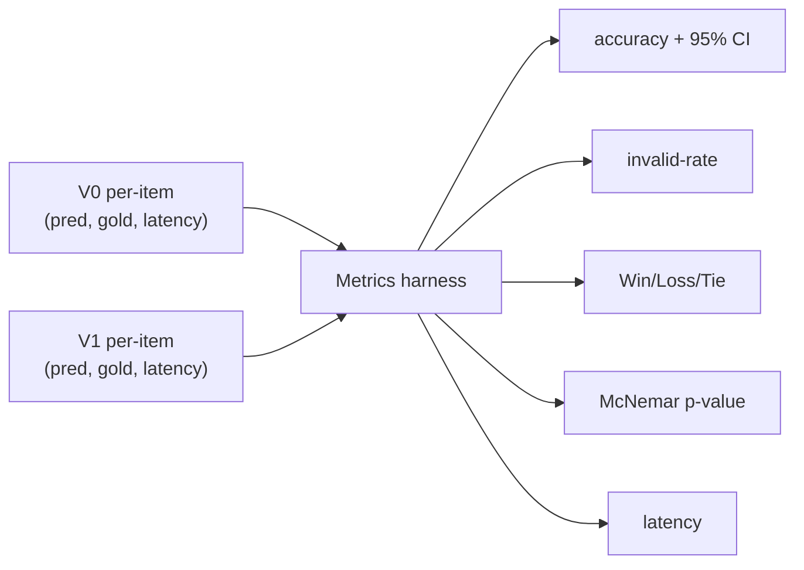

# Architecture — System Variants (V0–V4)

This document describes the current five-variant ablation ladder (V0 Direct LLM → V4 full
multi-agent system), every component it uses, and **why** each was chosen. The tail of this
document (from "Component choices & rationale" on) is a historical record of an earlier design —
see the callout there before citing anything from it as current.

Every variant is a **LangGraph `StateGraph`**, assembled from an internal `RunConfig` by
`graph/build.py:build_graph(cfg)`. All variants expose the same interface —
`answer(item: MCQItem) -> AnswerResult(answer, rationale)` — and are selected through a single switch
(`qa/variants.py`). Every variant returns a short (≤30 word) explanation alongside its choice, per spec §3:

```python
from agent_hospital.qa import build_variant
answer = build_variant("V3", model="qwen2.5:14b")   # V0..V4
```



Each variant is a preset `RunConfig` (`qa/variants.py:_PRESETS`) compiled into a graph. Adding a
variant or A/B-testing a knob (model, embedder, panel size, verifier on/off) is a config change, not
new code, and every variant is evaluated identically. `RunConfig` is internal;
`build_variant(id, model=, temperature=, **overrides)` is the public surface.

---

## Shared infrastructure

| Piece | What | File |
|---|---|---|
| **Agent** | thin lazy wrapper over LangChain v1 `create_agent`; builds the graph on first use | `agents/base.py` |
| **Model access** | any `BaseChatModel`; a bare string → local `ChatOllama` (provider-agnostic) | `agents/base.py` |
| **Config** | `RunConfig` (answer role, rag, panel_size, aggregate, verify, memory, verify_rag, per-role models) + `RagConfig` | `config.py` |
| **Roles** | `ROLE_PROMPTS` — baseline · rag-answerer · rag-agent · specialist · attending · verifier · scribe | `roles.py` |
| **Graph** | `QAState` + node factories (reason/retrieve/answer/agent/panel/scribe/aggregate/verify) + `build_graph(cfg)` | `graph/` |
| **Variant switch** | `_PRESETS` (V0–V4) + `build_variant(id, model, **overrides)` → uniform `answer` fn | `qa/variants.py` |
| **Eval harness** | per-item records (pred, gold, latency, rationale) → accuracy+CI, invalid-rate, Win/Loss/Tie, McNemar | `qa/metrics.py` |
| **Data** | `openlifescienceai/medqa` (4-option MCQ; train 10,178 / val 1,272 / test 1,273) | `diseases/medqa_usmle.py` |

**Why this shape:** the goal is an **ablation ladder** — every variant differs by *exactly one thing*
and is scored the same way, so accuracy differences are attributable. A single config-driven graph
builder + one metrics harness is meant to guarantee that; today it holds for V0→V1→V2→V3 (V1 adds
agentic RAG, V2 adds the panel/attending/verifier, V3 adds short-term memory) but **not for V4** — see
the caveat below.

> **Open caveat — V4 is not currently `V3` minus the verifier.** V4's preset predates the MedAgents-style
> rebuild of V1–V3 (agentic tool-driven retrieval over MedMCQA) and was never updated: it still uses
> graph-invoked textbook retrieval (`knowledge_medcpt`, MedCPT, gated) and a 2-specialist panel, vs. V3's
> agentic MedMCQA retrieval and 3-specialist panel. So `V3 − V4` currently confounds the verifier with the
> corpus, embedder, retrieval mode, and panel size — it does **not** isolate the verifier's contribution
> as the report claims. Fix: redefine `V4 = replace(_PRESETS["V3"], verify=False)` before it is measured
> or reported on.

### MedQA-USMLE row schema (`openlifescienceai/medqa`)

Each row nests the item under a `data` dict:

| Field | Type | Holds |
|---|---|---|
| `id` | string | upstream UUID (**not** used — see below) |
| `data.Question` | string | clinical vignette **+** question stem (the full prompt) |
| `data.Options` | dict | `{"A": …, "B": …, "C": …, "D": …}` |
| `data.Correct Option` | string | the correct letter, e.g. `"B"` |
| `subject_name` | string | often empty |

Cached locally as Arrow files (`~/.cache/huggingface/datasets/`), memory-mapped by `datasets`.
Our loader (`diseases/medqa_usmle.py`) maps each row → `MCQItem`: `data.Question → question`,
`Options[A..D] → options`, `index("ABCD", Correct Option) → answer_idx`. Splits are named
`train` / **`dev`** / `test` upstream; `"validation"` is aliased to `dev`, so
train 10,178 / validation 1,272 / test 1,273.

**Ids are positional** (`test-00000`), not upstream UUIDs, so they stay stable across dataset
mirrors — the golden file and prediction files key on them. Verified against the previous mirror:
**0 question and 0 gold-answer mismatches** across all 1,273 test items.

---

## V0 — Direct LLM (the control)


- **No retrieval, no reasoning, no panel** — the graph is a single `answer` node (`answer_role="baseline"`,
  `rag=None`); `build_graph` wires only `START → answer → END`.
- Prompt = vignette + four options + a ≤30-word justification then `Answer: X` (`roles.py:BASELINE`,
  `qa/mcq.py:format_mcq` with `REASON_THEN_ANSWER`).
- `parse_choice` extracts A–D (`Answer: X`, else a lone letter); unparseable → `None` (an invalid
  response, never a silent wrong).

**Why it exists:** it is the **baseline every other variant is measured against**. Accuracy gain is
`Acc(Vn) − Acc(V0)`, so V0 must be the purest possible single-call LLM with no extras.

---

## V1 — RAG-only (single agentic-RAG agent)

V1 = V0 **plus** one bound tool: a single agent, given `search_medmcqa`, decides for itself whether
and what to search.



- **One node, one agent.** `build_graph` takes a dedicated branch when `cfg.rag.tool=True` and there is
  no panel/aggregate (`graph/build.py:20`): a single `agent` node, `make_agentic_rag_node`
  (`graph/nodes.py:164`), wraps `Agent("rag-agent", tools=[search_medmcqa])` — no separate reason/retrieve
  nodes, because retrieval is folded into the one agent as a tool call.
- **Corpus = MedMCQA** (`knowledge_medmcqa_nomic`), not textbook prose — retrieves similar **solved exam
  questions** with their answer + explanation (Medprompt-style exemplar retrieval), embedded with
  `nomic-embed-text` (8192-token context, so the query encoder doesn't truncate the vignette the way
  MedCPT's 64-token query encoder would). **No gate** (`threshold=0.0`) — the agent sees the top-5 and is
  trusted to weigh an analogous question rather than copy its answer.
- **Cost:** letting the model choose when to call a tool costs one extra round-trip vs. a graph-invoked
  call, because the model must be re-invoked to consume the tool result (see D19 for the measured
  agentic-vs-graph-invoked comparison; V1 itself has since moved to the agentic side of that trade-off).
- **Measured (full test, n=1273, qwen2.5:7b):** **0.573** accuracy — below V0's 0.615 — and **3.85%
  invalid**, the highest of any variant: the tool-call loop sometimes doesn't converge on a final letter.
  See `report.tex` §5 for the full table.

---

## V2 — Multi-agent panel (MedAgents-style)

5 agents: 3 specialists (each with agentic RAG over `search_medmcqa`) → an attending that aggregates →
a verifier that double-checks against a *separate* corpus.



- **Panel** (`make_panel_node`, `graph/nodes.py:193`): `panel_size=3` specialists, each a distinct
  `roles.PERSPECTIVES` framing (favor-most-likely / rule-out-dangerous / mechanism-first) cycled by index
  so a temperature-0 panel still disagrees; each specialist holds its own `search_medmcqa` tool call.
- **Attending** (`make_aggregate_node`): reads all opinions, weighs them, commits to a letter.
- **Verifier** (`make_verify_node`): holds an **independent** `search_textbooks` tool over MedRAG
  Textbooks (`knowledge_medcpt`, MedCPT, `verify_rag=RagConfig(threshold=0.0)`) — a *different* corpus
  from the panel's solved-exemplar MedMCQA, so the verifier checks the proposed answer against reference
  textbook fact rather than re-consulting the same exam-question analogies the panel already saw.
- **Measured (full test, n=1273):** **0.608** accuracy (~level with V0), **0% invalid** (the panel +
  verifier structure eliminates V1's tool-convergence problem), but **~25× V0's latency and ~16× its
  tokens** (`report.tex` §5) for no net accuracy gain over the direct baseline yet.

---

## V3 — V2 + short-term memory

Identical to V2, plus a `scribe` node between the panel and the attending: it condenses the three
specialists' opinions into shared **working notes** (`state["working_memory"]`), which the attending
and verifier then read instead of the raw opinions (`_panel_context`, `graph/nodes.py:226`). `V3 − V2`
isolates the effect of that shared working memory alone.

**Status: builds and runs end-to-end (verified live), but not yet measured** — no accuracy numbers
exist yet; `report.tex` marks this row `\todo`.

> **No long-term/cross-episode memory exists anywhere in this codebase.** Spec §4.5 (long-term memory)
> is not met by any variant — only V3's per-episode working memory (§4.4, short-term) is built. See
> `docs/REPORT_NOTES.md` and `docs/TECHNICAL_DECISIONS.md` (D4) for the earlier plan (retrieving
> rationales from solved MedQA-train mistakes) that was descoped and remains future work.

---

## V4 — full system without verifier (stale preset — see the ladder caveat above)

Preset frozen from **before** V1–V3's agentic MedAgents-style rebuild: `reason → retrieve → panel(2) →
aggregate`, using graph-invoked textbook retrieval (`knowledge_medcpt`, MedCPT, gate 0.60), no memory,
no verifier. It builds and runs (verified live), but because its corpus, embedder, retrieval mode, and
panel size all differ from V3's, **it does not currently isolate the verifier's marginal contribution**
the way its name and the report imply — see the caveat at the top of this document for the fix.

---

> **Historical from here down.** Everything below (component choices, the MedRAG deep-dive, the
> n=80 measured-results table, design principles) documents the design **before** V1–V3 were rebuilt as
> agentic MedAgents-style panels over MedMCQA — i.e. the "V1 = graph-invoked textbook RAG" / "V2 =
> clinical-reasoner + decider" era described in the old mermaid diagrams that used to sit above this
> line. It stays as the evidence trail that motivated the rebuild (the RAG-barely-helps finding, the
> query-distillation lift, the 32B-no-gain result). For the **current** V0–V4 design see the sections
> above; for **current** full-test-set numbers see `report.tex` / `docs/REPORT_NOTES.md`.

## Component choices & rationale

| Component | Choice | Why this choice |
|---|---|---|
| **RAG source / corpus** | **MedRAG Textbooks** — 18 USMLE textbooks, **125,847** pre-chunked snippets | **Leakage-safe** (reference text, not exam Q/A); the **exam is written against these books**, matching the query distribution; open + **pre-chunked**. PubMed/Wikipedia rejected — ~24–30M snippets, too big to embed locally. |
| **Chunking** | MedRAG snippets **as-is** | already chunked by the authors; avoids re-chunking guesswork now. |
| **Embedding model** | **MedCPT** (medical-domain, asymmetric bi-encoder, 768-d, local) | domain-tuned for biomedical retrieval. Its HF download originally hard-stalled (0 MB/s) so `nomic-embed-text` was the interim default; MedCPT was fetched via `curl` (D13), re-ingested into its own collection (D12), and is now the default. `nomic` remains a one-line swap via `default_embeddings()`. |
| **Vector store** | **Chroma**, persistent, **cosine (HNSW)** | local, no server, native LangChain integration; cosine space set explicitly so relevance scores feed the gate. |
| **Retrieval algorithm** | **dense VSM** — cosine, **top-k = 4**, **similarity gate ≥ 0.60 + no-RAG fallback** | dense captures clinical **paraphrase/synonyms** sparse misses; the **gate** stops off-topic snippets degrading answers (RAG was **−8 pts** without a sharp query/gate); k=4 balances evidence vs context bloat. Threshold is embedder-specific — MedCPT's asymmetric scores top out ≈0.69, so 0.60 is strict (evidence on ~4/6 sampled items). Sparse/BM25 + **hybrid** are documented future options. |
| **Query strategy** | **LLM query distillation** (retrieve on the focused question, not the raw vignette) | whole-vignette retrieval pulled **topical-but-non-discriminating** passages → **−8 pts**; distillation **flipped the lift to +2 pts**. |
| **Answering LLM** | **`qwen2.5:14b`** (Ollama, tool-calling) | best **capability/speed** on a 48 GB Mac; **32B gave no gain** (0.66 vs 0.68) at ~4× latency; 7B is the cheap baseline. Swappable via `build_variant(model=…)`. |
| **Scoring** | exact **MCQ option match** vs `label`; `None` = invalid | MedQA answers vary (dx/treatment/next-step), so the unit is "pick the right option", not a diagnosis string. |

---

## Knowledge base deep-dive — MedRAG

**MedRAG** (Xiong et al., 2024, *Benchmarking RAG for Medicine*) bundles three things: a corpus
collection ("MedCorp"), the **MIRAGE** benchmark, and a retrieval toolkit.

**Corpora (MedCorp):**

| Corpus | Scale | Content | Local-friendly |
|---|---|---|---|
| **Textbooks** | 18 USMLE books, **~125,847** snippets | exam-aligned reference | ✅ **we use this** |
| StatPearls | ~9,330 articles (chunked) | clinical point-of-care | ✅ feasible |
| PubMed | ~23.9M snippets | biomedical abstracts | ❌ too big locally |
| Wikipedia | ~29.9M snippets | general knowledge | ❌ too big locally |

Each ships on HuggingFace pre-chunked (`id, title, content, contents`); we index `content`. We use
**Textbooks only** — leakage-safe (reference text, not exam Q/A), USMLE-aligned, and small enough to
embed locally.

**MIRAGE** — a 5-dataset medical-QA benchmark (incl. MedQA, MedMCQA, PubMedQA, BioASQ, MMLU-Med).
**Role in our app: reference only.** We run our own harness on MedQA-USMLE (one MIRAGE dataset), not
MIRAGE itself; adopting the others later would show where RAG helps more.

**Our embeddings vs MedRAG's precomputed embeddings:**

| | MedRAG precomputed | Ours |
|---|---|---|
| Who embeds | MedRAG authors, shipped ready | we embed at ingest |
| Model | MedCPT / Contriever / SPECTER (some **medical-tuned**) | `nomic-embed-text` (general) |
| Cost | download vectors, no compute | we embed 125k snippets ourselves |
| Index | their format/retriever | our **Chroma** (cosine + gate) |

Vectors are **not interchangeable across models** (a `nomic` doc vector and a MedCPT query vector are in
different spaces), which is why each embedder needs its own collection. Both are now built:
`knowledge` (nomic) and `knowledge_medcpt` (MedCPT), 125,847 vectors each — so the embedder A/B is a
one-line config change.

**Why RAG barely helped MedQA (the key insight):** RAG gains are **uneven across datasets**.
Lookup-heavy sets (PubMedQA, BioASQ) benefit strongly; **reasoning/recall sets like MedQA barely do**,
because a strong model already encodes the textbook knowledge and the work is *reasoning*, not
fact-fetching. **This is exactly why our V1−V0 was a flat +2 pts (n.s.)** — MedQA is the reasoning kind,
the hardest case for retrieval. It also points the next lever at **reasoning** (a reasoning agent that
forms a sharper query, then the multi-agent pipeline), not more retrieval.

**MedCPT (revisiting):** MedRAG's strongest, medical-domain-tuned retriever — an asymmetric bi-encoder
(separate query/article encoders). Being retried as a drop-in via `knowledge/embeddings.py`; if it
loads, re-embed Textbooks with the article encoder and retrieve with the query encoder.

## Evaluation

- **Set:** 150 MedQA-USMLE **test** items (held out; train/val never scored).
- **Metrics (one per-item pass, `qa/metrics.py`):** accuracy + **95% bootstrap CI**, **invalid-rate**,
  **Win/Loss/Tie**, **McNemar** (exact paired test), **mean latency**.
- **Why these:** accuracy alone is a point estimate; **McNemar** (paired, same items) answers *"is the
  gain real?"* and the **bootstrap CI** bounds it; invalid-rate guards against parsing artifacts.



### Measured results (qwen2.5:14b, **temperature=0**, 80 test items)

| | V0 — Direct LLM | V1 — RAG-only | V2 — Multi-agent |
|---|---|---|---|
| Accuracy | 0.662 | 0.625 | **0.738** |
| 95% bootstrap CI | [0.562, 0.762] | [0.525, 0.725] | [0.637, 0.825] |
| Invalid rate | 0.0% | 0.0% | 0.0% |
| Latency / item | 0.63 s | 2.84 s | 7.35 s |

| Pairing | gain | Win/Loss/Tie | McNemar p |
|---|---|---|---|
| V1 vs V0 | −3.7 pts | 7 / 10 / 63 | 0.63 (n.s.) |
| V2 vs V0 | +7.5 pts | 10 / 4 / 66 | 0.18 (n.s.) |
| **V2 vs V1** | **+11.3 pts** | **11 / 2 / 67** | **0.023 (significant)** |

**Interpretation:**
- **Single-agent RAG (V1) does not help** — again slightly *below* V0 (also seen at 150 items: 0.727 vs
  0.720). Retrieval is not the lever on MedQA (reasoning-heavy, not lookup).
- **Multi-agent (V2) is the first real gain** — top accuracy (0.738), and its win over **V1 is
  statistically significant (p=0.023)**. The gain comes from the reasoner→specialist reasoning, not RAG.
- **V2 vs V0 = +7.5 pts but not yet significant (p=0.18)** at n=80 (small-sample; V0 here is 0.662 vs
  0.72 on the 150-set) — promising, to be confirmed at larger n.

**V3/V4 status:** built and functionally verified end-to-end (graph runs, 0 invalid), but **not yet
measured at n ≥ 80**. The scale run of V3 (panel+attending+verifier) and V4 (no verifier) — plus V3 vs V4
to isolate the verifier — is the next evaluation step.

---

## Design principles

1. **One-thing-at-a-time ablation** — V0→V1 differs only by RAG, so +2 pts is attributable to RAG.
2. **Everything is a swap-point** — embedder, model, retrieval params — change one, re-measure cheaply.
3. **Leakage discipline** — corpus = textbooks (never exam items); only the held-out test split is scored.
4. **Honest measurement** — paired significance (McNemar) + CIs, not bare accuracy.
