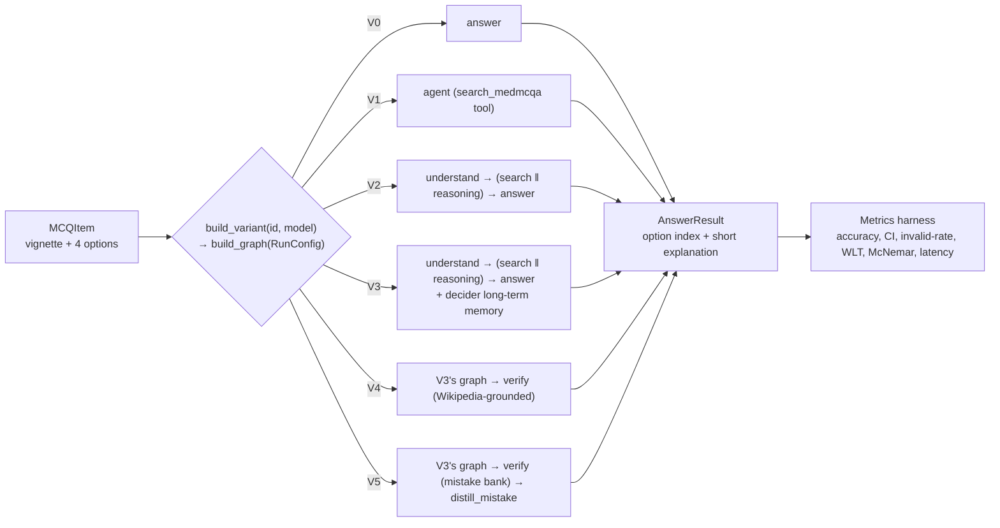
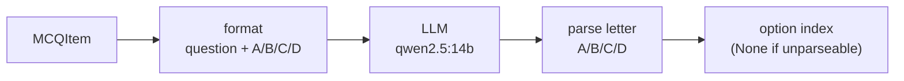
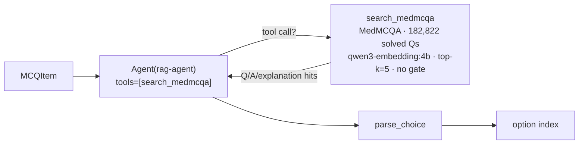
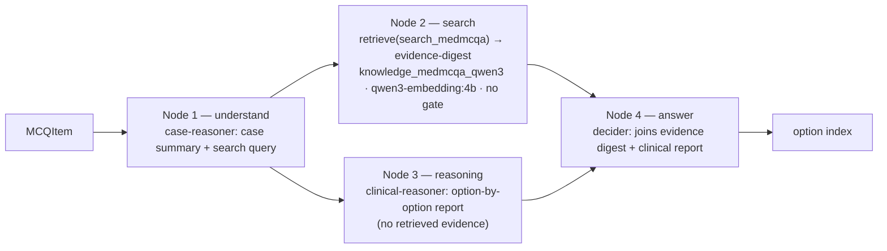
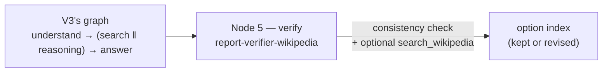
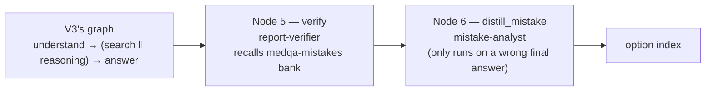
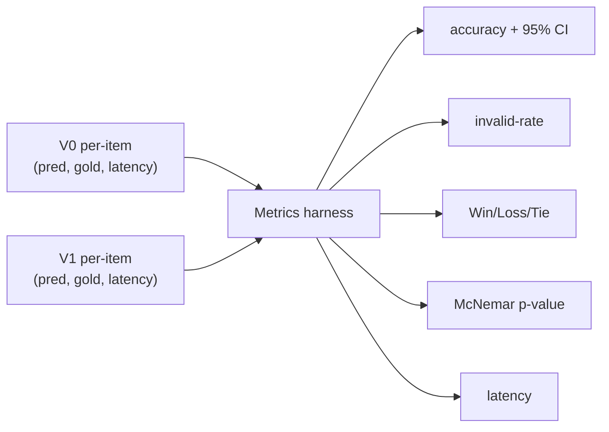

# Architecture — System Variants (V0–V5)

This document describes the current six-variant ablation ladder (V0 Direct LLM → V5 full
multi-agent system with an evolving mistake bank), every component it uses, and **why** each was
chosen. The tail of this document (from "Component choices & rationale" on) is a historical record
of an earlier design — see the callout there before citing anything from it as current.

Every variant is a **LangGraph `StateGraph`**, assembled from an internal `RunConfig` by
`graph/build.py:build_graph(cfg)`. All variants expose the same interface —
`answer(item: MCQItem) -> AnswerResult(answer, rationale)` — and are selected through a single switch
(`qa/variants.py`). Every variant returns a short (≤30 word) explanation alongside its choice, per spec §3:

```python
from agent_hospital.qa import build_variant
answer = build_variant("V3", model="qwen2.5:14b")   # V0..V5
```



Each variant is a preset `RunConfig` (`qa/variants.py:_PRESETS`) compiled into a graph. Adding a
variant or A/B-testing a knob (model, embedder, verifier grounding, long-term memory) is a config
change, not new code, and every variant is evaluated identically. `RunConfig` is internal;
`build_variant(id, model=, temperature=, **overrides)` is the public surface.

---

## Shared infrastructure

| Piece | What | File |
|---|---|---|
| **Agent** | thin lazy wrapper over LangChain v1 `create_agent`; builds the graph on first use | `agents/base.py` |
| **Model access** | any `BaseChatModel`; a bare string → local `ChatOllama` (provider-agnostic) | `agents/base.py` |
| **Config** | `RunConfig` (answer role, rag, clinical_reason, verify, memory, long_term(_mistakes), verify_rag/verify_wikipedia, per-role models) + `RagConfig` | `config.py` |
| **Roles** | `ROLE_PROMPTS` — baseline · rag-agent · case-reasoner · clinical-reasoner · evidence-digest · decider · report-verifier(-wikipedia) · mistake-analyst | `roles.py` |
| **Graph** | `QAState` + node factories (reason/retrieve/understand/search/reasoning/answer/verify/distill_mistake) + `build_graph(cfg)` | `graph/` |
| **Long-term memory** | `graph/longterm.py` — SQLite-backed cross-episode lesson bank (`medqa-lessons`, V3-V5) and mistake bank (`medqa-mistakes`, V5) | `graph/longterm.py` |
| **Variant switch** | `_PRESETS` (V0–V5) + `build_variant(id, model, **overrides)` → uniform `answer` fn | `qa/variants.py` |
| **Eval harness** | per-item records (pred, gold, latency, rationale) → accuracy+CI, invalid-rate, Win/Loss/Tie, McNemar | `qa/metrics.py` |
| **Data** | `openlifescienceai/medqa` (4-option MCQ; train 10,178 / val 1,272 / test 1,273) | `diseases/medqa_usmle.py` |

**Why this shape:** the goal is an **ablation ladder** — every variant differs by *exactly one thing*
and is scored the same way, so accuracy differences are attributable. V0→V1 adds agentic RAG;
V1→V2 splits that single agent into four specialized nodes (case-reasoner, search+digest,
clinical-reasoner, decider); V2→V3 gives the decider a cross-episode lesson bank; V3→V4 and V3→V5
each add exactly one verifier node on top of V3's graph, differing only in what that verifier
checks against (live Wikipedia vs. a self-evolving mistake bank) — so `V4 − V3` and `V5 − V3` each
isolate one verifier design's marginal contribution, with no other confound.

### MedQA-USMLE row schema (`openlifescienceai/medqa`)

Each row nests the item under a `data` dict:

| Field | Type | Holds |
|---|---|---|
| `id` | string | upstream UUID (**not** used — see below) |
| `data.Question` | string | clinical vignette **+** question stem (the full prompt) |
| `data.Options` | dict | `{"A": …, "B": …, "C": …, "D": …}` |
| `data.Correct Option` | string | the correct letter, e.g. `"B"` |
| `subject_name` | string | often empty |

Cached locally as Arrow files (`~/.cache/huggingface/datasets/`), memory-mapped by `datasets`.
Our loader (`diseases/medqa_usmle.py`) maps each row → `MCQItem`: `data.Question → question`,
`Options[A..D] → options`, `index("ABCD", Correct Option) → answer_idx`. Splits are named
`train` / **`dev`** / `test` upstream; `"validation"` is aliased to `dev`, so
train 10,178 / validation 1,272 / test 1,273.

**Ids are positional** (`test-00000`), not upstream UUIDs, so they stay stable across dataset
mirrors — the golden file and prediction files key on them. Verified against the previous mirror:
**0 question and 0 gold-answer mismatches** across all 1,273 test items.

---

## V0 — Direct LLM (the control)



- **No retrieval, no reasoning, no panel** — the graph is a single `answer` node (`answer_role="baseline"`,
  `rag=None`); `build_graph` wires only `START → answer → END`.
- Prompt = vignette + four options + a ≤30-word justification then `Answer: X` (`roles.py:BASELINE`,
  `qa/mcq.py:format_mcq` with `REASON_THEN_ANSWER`).
- `parse_choice` extracts A–D (`Answer: X`, else a lone letter); unparseable → `None` (an invalid
  response, never a silent wrong).

**Why it exists:** it is the **baseline every other variant is measured against**. Accuracy gain is
`Acc(Vn) − Acc(V0)`, so V0 must be the purest possible single-call LLM with no extras.

---

## V1 — RAG-only (single agentic-RAG agent)

V1 = V0 **plus** one bound tool: a single agent, given `search_medmcqa`, decides for itself whether
and what to search.



- **One node, one agent.** `build_graph` takes a dedicated branch when `cfg.rag.tool=True` and
  `cfg.clinical_reason=False` (`graph/build.py`): a single `agent` node, `make_agentic_rag_node`
  (`graph/nodes.py`), wraps `Agent("rag-agent", tools=[search_medmcqa])` — no separate reason/retrieve
  nodes, because retrieval is folded into the one agent as a tool call.
- **Corpus = MedMCQA** (`knowledge_medmcqa_qwen3`), not textbook prose — retrieves similar **solved exam
  questions** with their answer + explanation (Medprompt-style exemplar retrieval), embedded with
  `qwen3-embedding:4b`. **No gate** (`threshold=0.0`) — the agent sees the top-5 and is trusted to weigh
  an analogous question rather than copy its answer.
- **Cost:** letting the model choose when to call a tool costs one extra round-trip vs. a graph-invoked
  call, because the model must be re-invoked to consume the tool result (see D19 for the measured
  agentic-vs-graph-invoked comparison).
- **Historically shown a real invalid-response problem** (tool-call loop not always converging on a
  final letter) — V2's split into dedicated nodes (below) removes the model's discretion over *whether*
  to search, which eliminates it. See `report.tex` §5 / `data/eval_runs/` for current numbers.

---

## V2 — Four-node design: understand → (search ‖ reasoning) → decide

V1's single agent does four jobs itself in one pass (understand the case, search, reason, decide). V2
splits those into four nodes so each has a focused prompt; Node 2 (search) and Node 3 (reasoning) run
**concurrently**, sharing Node 1's output but never seeing each other's, then Node 4 (the decider) joins
and weighs both — mirroring exactly how V1's single agent weighs its own search result against its own
reasoning.



- **Node 1 (`understand`, `make_understand_node`, role `case-reasoner`):** reads the vignette once,
  produces a case summary *and* a search query, shared by both downstream branches so neither
  re-derives its own understanding of the case.
- **Node 2 (`search`, `make_search_branch_node`):** retrieves via `make_retrieve_node` (graph-invoked,
  not agentic — the query from Node 1 is used directly, no tool-call round trip) then digests the raw
  passages into a confidence-rated summary (`make_evidence_digest_node`, role `evidence-digest`).
  Bundled into one node so it shares a LangGraph superstep with Node 3 for real concurrency.
- **Node 3 (`reasoning`, `make_reasoning_node`, role `clinical-reasoner`):** reasons from Node 1's case
  summary using only its own medical knowledge — never sees Node 2's retrieved evidence, and never
  names an answer itself; it produces an option-by-option verdict report for the decider to read.
- **Node 4 (`answer`, `make_answer_node`, role `decider`):** the join point. Same asymmetric-trust rule
  as V1's own decide step: the evidence digest's *own* confidence rating decides whether it's trusted by
  default (HIGH → wins unless the reasoning report names a specific finding it overlooked) or set aside
  in favor of the clinical-reasoning report (MEDIUM/LOW/absent).

`build_graph` wires this whenever `cfg.clinical_reason=True` and `cfg.rag.tool=False`
(`graph/build.py`); a join with more than one predecessor uses the list form of `add_edge` so Node 4
runs exactly once after both Node 2 and Node 3 complete, not twice.

---

## V3 — V2 + the decider's long-term memory

Identical graph to V2 (same four nodes) — `cfg.long_term=True` adds no new node. Instead, Node 4 (the
decider, in `make_answer_node`) also **recalls and writes** a cross-episode lesson bank
(`graph/longterm.py`, a SQLite-backed `BaseStore`, namespace `medqa-lessons`): before answering, it
recalls up to 3 lessons from topically-similar past cases (`longterm.recall`, ranked by keyword overlap,
not an embedding index); after answering, it extracts a `Lesson:` line from its own reply and writes it
back (`longterm.remember`). `V3 − V2` isolates the effect of that lesson bank alone.

Writing happens by default whenever `cfg.long_term=True` — including while scoring a split, which lets
lessons from earlier items in a run leak into later ones. For a clean, reproducible report number, pass
`long_term_read_only=True` as an override so recall still happens but nothing is written.

**Status: builds and runs end-to-end** — full-test-set measurement is in progress; see `report.tex` §5
or `data/eval_runs/` for current numbers.

---

## V4 — V3 + a verifier grounded in live Wikipedia

Adds exactly one node (Node 5, `verify`) after V3's `answer`: a cheap final check, not a second full
derivation.



- **Node 5 (`verify`, `make_report_verify_node`, role `report-verifier-wikipedia`):** first checks
  whether the decider's chosen letter is *consistent* with Node 3's own option-by-option verdicts
  (near-free — that report already did the work). Only if the report alone doesn't settle it does it
  call `search_wikipedia` (`knowledge/wikipedia.py`, live MediaWiki API, capped at 2 calls, degrades to
  `""` on any network failure) targeted at the chosen option specifically.
- **Why Wikipedia, not the local corpus:** the local MedMCQA collection is itself built from the same
  benchmark family being scored, so checking against it isn't independent evidence. Wikipedia is an
  external, independent source. (A textbook-grounded verifier via `verify_rag` is still available as an
  override — see the [MedCPT section of the README](../README.md#medcpt--the-textbook-embedder-optional)
  — but no preset uses it by default anymore.)
- **`V4 − V3` isolates this verifier's marginal contribution** with no other confound — same corpus,
  embedder, and node graph as V3, differing only in Node 5.

**Status: builds and runs end-to-end** — full-test-set measurement is in progress; see `report.tex` §5
or `data/eval_runs/` for current numbers.

---

## V5 — V3 + a verifier that recalls its own evolving mistake bank

Adds the *same* Node 5 role family as V4 (`report-verifier`), but with a different — and, for this
variant, exclusive — evidence source: instead of Wikipedia, it recalls a **separate** mistake bank
(`graph/longterm.py`, namespace `medqa-mistakes`) of cases the system has gotten wrong before. It has no
search tool of its own. V5 also adds one further node after `verify`:



- **Node 5 (`verify`):** same consistency check as V4, but its optional grounding step is
  `longterm.recall_mistakes` — lessons from *other, topically similar* cases the system previously
  answered wrong, not the current one. Never sees or writes gold.
- **Node 6 (`distill_mistake`, `make_mistake_distill_node`, role `mistake-analyst`):** the **only** node
  in the entire graph that ever reads the gold answer (`item.answer_idx`). Runs after `verify`; a
  correct final answer is a no-op. A wrong one gets one extra LLM call — shown the correct option — that
  distills a corrective lesson into the mistake bank (`longterm.remember_mistake`) for a *future* similar
  case to recall. It never touches `state["answer"]`/`state["rationale"]`, so it cannot affect the score
  of the item it just ran on, only future ones. Skips entirely under `long_term_read_only=True`.
- **`V5 − V3` isolates this verifier design's marginal contribution**, exactly as `V4 − V3` does for the
  Wikipedia-grounded design — same base graph, differing only in Node 5 (and, for V5, Node 6).

**Status: builds and runs end-to-end** — full-test-set measurement is in progress; see `report.tex` §5
or `data/eval_runs/` for current numbers.

---

> **Historical from here down.** Everything below (component choices, the MedRAG deep-dive, the
> n=80 measured-results table, design principles) documents the design **before** V1–V3 were rebuilt as
> agentic MedAgents-style panels over MedMCQA — i.e. the "V1 = graph-invoked textbook RAG" / "V2 =
> clinical-reasoner + decider" era described in the old mermaid diagrams that used to sit above this
> line. It stays as the evidence trail that motivated the rebuild (the RAG-barely-helps finding, the
> query-distillation lift, the 32B-no-gain result). For the **current** V0–V5 design see the sections
> above; for **current** measured numbers see `report.tex` / `data/eval_runs/`.

## Component choices & rationale

| Component | Choice | Why this choice |
|---|---|---|
| **RAG source / corpus** | **MedRAG Textbooks** — 18 USMLE textbooks, **125,847** pre-chunked snippets | **Leakage-safe** (reference text, not exam Q/A); the **exam is written against these books**, matching the query distribution; open + **pre-chunked**. PubMed/Wikipedia rejected — ~24–30M snippets, too big to embed locally. |
| **Chunking** | MedRAG snippets **as-is** | already chunked by the authors; avoids re-chunking guesswork now. |
| **Embedding model** | **MedCPT** (medical-domain, asymmetric bi-encoder, 768-d, local) | domain-tuned for biomedical retrieval. Its HF download originally hard-stalled (0 MB/s) so `nomic-embed-text` was the interim default; MedCPT was fetched via `curl` (D13), re-ingested into its own collection (D12), and is now the default. `nomic` remains a one-line swap via `default_embeddings()`. |
| **Vector store** | **Chroma**, persistent, **cosine (HNSW)** | local, no server, native LangChain integration; cosine space set explicitly so relevance scores feed the gate. |
| **Retrieval algorithm** | **dense VSM** — cosine, **top-k = 4**, **similarity gate ≥ 0.60 + no-RAG fallback** | dense captures clinical **paraphrase/synonyms** sparse misses; the **gate** stops off-topic snippets degrading answers (RAG was **−8 pts** without a sharp query/gate); k=4 balances evidence vs context bloat. Threshold is embedder-specific — MedCPT's asymmetric scores top out ≈0.69, so 0.60 is strict (evidence on ~4/6 sampled items). Sparse/BM25 + **hybrid** are documented future options. |
| **Query strategy** | **LLM query distillation** (retrieve on the focused question, not the raw vignette) | whole-vignette retrieval pulled **topical-but-non-discriminating** passages → **−8 pts**; distillation **flipped the lift to +2 pts**. |
| **Answering LLM** | **`qwen2.5:14b`** (Ollama, tool-calling) | best **capability/speed** on a 48 GB Mac; **32B gave no gain** (0.66 vs 0.68) at ~4× latency; 7B is the cheap baseline. Swappable via `build_variant(model=…)`. |
| **Scoring** | exact **MCQ option match** vs `label`; `None` = invalid | MedQA answers vary (dx/treatment/next-step), so the unit is "pick the right option", not a diagnosis string. |

---

## Knowledge base deep-dive — MedRAG

**MedRAG** (Xiong et al., 2024, *Benchmarking RAG for Medicine*) bundles three things: a corpus
collection ("MedCorp"), the **MIRAGE** benchmark, and a retrieval toolkit.

**Corpora (MedCorp):**

| Corpus | Scale | Content | Local-friendly |
|---|---|---|---|
| **Textbooks** | 18 USMLE books, **~125,847** snippets | exam-aligned reference | ✅ **we use this** |
| StatPearls | ~9,330 articles (chunked) | clinical point-of-care | ✅ feasible |
| PubMed | ~23.9M snippets | biomedical abstracts | ❌ too big locally |
| Wikipedia | ~29.9M snippets | general knowledge | ❌ too big locally |

Each ships on HuggingFace pre-chunked (`id, title, content, contents`); we index `content`. We use
**Textbooks only** — leakage-safe (reference text, not exam Q/A), USMLE-aligned, and small enough to
embed locally.

**MIRAGE** — a 5-dataset medical-QA benchmark (incl. MedQA, MedMCQA, PubMedQA, BioASQ, MMLU-Med).
**Role in our app: reference only.** We run our own harness on MedQA-USMLE (one MIRAGE dataset), not
MIRAGE itself; adopting the others later would show where RAG helps more.

**Our embeddings vs MedRAG's precomputed embeddings:**

| | MedRAG precomputed | Ours |
|---|---|---|
| Who embeds | MedRAG authors, shipped ready | we embed at ingest |
| Model | MedCPT / Contriever / SPECTER (some **medical-tuned**) | `nomic-embed-text` (general) |
| Cost | download vectors, no compute | we embed 125k snippets ourselves |
| Index | their format/retriever | our **Chroma** (cosine + gate) |

Vectors are **not interchangeable across models** (a `nomic` doc vector and a MedCPT query vector are in
different spaces), which is why each embedder needs its own collection. Both are now built:
`knowledge` (nomic) and `knowledge_medcpt` (MedCPT), 125,847 vectors each — so the embedder A/B is a
one-line config change.

**Why RAG barely helped MedQA (the key insight):** RAG gains are **uneven across datasets**.
Lookup-heavy sets (PubMedQA, BioASQ) benefit strongly; **reasoning/recall sets like MedQA barely do**,
because a strong model already encodes the textbook knowledge and the work is *reasoning*, not
fact-fetching. **This is exactly why our V1−V0 was a flat +2 pts (n.s.)** — MedQA is the reasoning kind,
the hardest case for retrieval. It also points the next lever at **reasoning** (a reasoning agent that
forms a sharper query, then the multi-agent pipeline), not more retrieval.

**MedCPT (revisiting):** MedRAG's strongest, medical-domain-tuned retriever — an asymmetric bi-encoder
(separate query/article encoders). Being retried as a drop-in via `knowledge/embeddings.py`; if it
loads, re-embed Textbooks with the article encoder and retrieve with the query encoder.

## Evaluation

- **Set:** 150 MedQA-USMLE **test** items (held out; train/val never scored).
- **Metrics (one per-item pass, `qa/metrics.py`):** accuracy + **95% bootstrap CI**, **invalid-rate**,
  **Win/Loss/Tie**, **McNemar** (exact paired test), **mean latency**.
- **Why these:** accuracy alone is a point estimate; **McNemar** (paired, same items) answers *"is the
  gain real?"* and the **bootstrap CI** bounds it; invalid-rate guards against parsing artifacts.



### Measured results (qwen2.5:14b, **temperature=0**, 80 test items)

| | V0 — Direct LLM | V1 — RAG-only | V2 — Multi-agent |
|---|---|---|---|
| Accuracy | 0.662 | 0.625 | **0.738** |
| 95% bootstrap CI | [0.562, 0.762] | [0.525, 0.725] | [0.637, 0.825] |
| Invalid rate | 0.0% | 0.0% | 0.0% |
| Latency / item | 0.63 s | 2.84 s | 7.35 s |

| Pairing | gain | Win/Loss/Tie | McNemar p |
|---|---|---|---|
| V1 vs V0 | −3.7 pts | 7 / 10 / 63 | 0.63 (n.s.) |
| V2 vs V0 | +7.5 pts | 10 / 4 / 66 | 0.18 (n.s.) |
| **V2 vs V1** | **+11.3 pts** | **11 / 2 / 67** | **0.023 (significant)** |

**Interpretation:**
- **Single-agent RAG (V1) does not help** — again slightly *below* V0 (also seen at 150 items: 0.727 vs
  0.720). Retrieval is not the lever on MedQA (reasoning-heavy, not lookup).
- **Multi-agent (V2) is the first real gain** — top accuracy (0.738), and its win over **V1 is
  statistically significant (p=0.023)**. The gain comes from the reasoner→specialist reasoning, not RAG.
- **V2 vs V0 = +7.5 pts but not yet significant (p=0.18)** at n=80 (small-sample; V0 here is 0.662 vs
  0.72 on the 150-set) — promising, to be confirmed at larger n.

**V3/V4 status:** built and functionally verified end-to-end (graph runs, 0 invalid), but **not yet
measured at n ≥ 80**. The scale run of V3 (panel+attending+verifier) and V4 (no verifier) — plus V3 vs V4
to isolate the verifier — is the next evaluation step.

---

## Design principles

1. **One-thing-at-a-time ablation** — V0→V1 differs only by RAG, so +2 pts is attributable to RAG.
2. **Everything is a swap-point** — embedder, model, retrieval params — change one, re-measure cheaply.
3. **Leakage discipline** — corpus = textbooks (never exam items); only the held-out test split is scored.
4. **Honest measurement** — paired significance (McNemar) + CIs, not bare accuracy.
