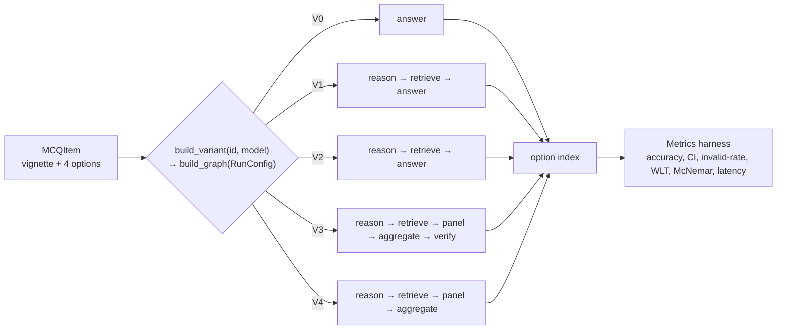
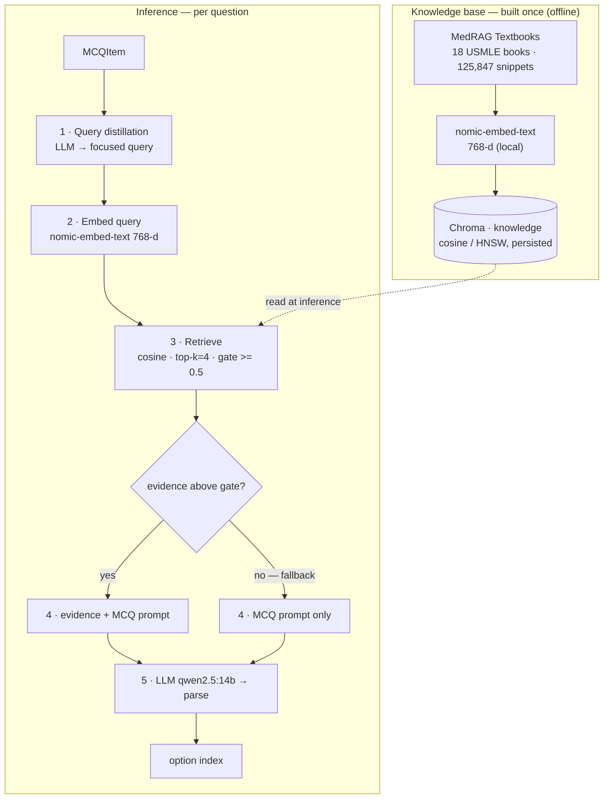
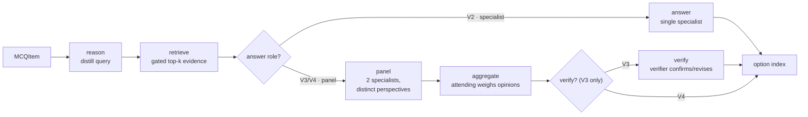
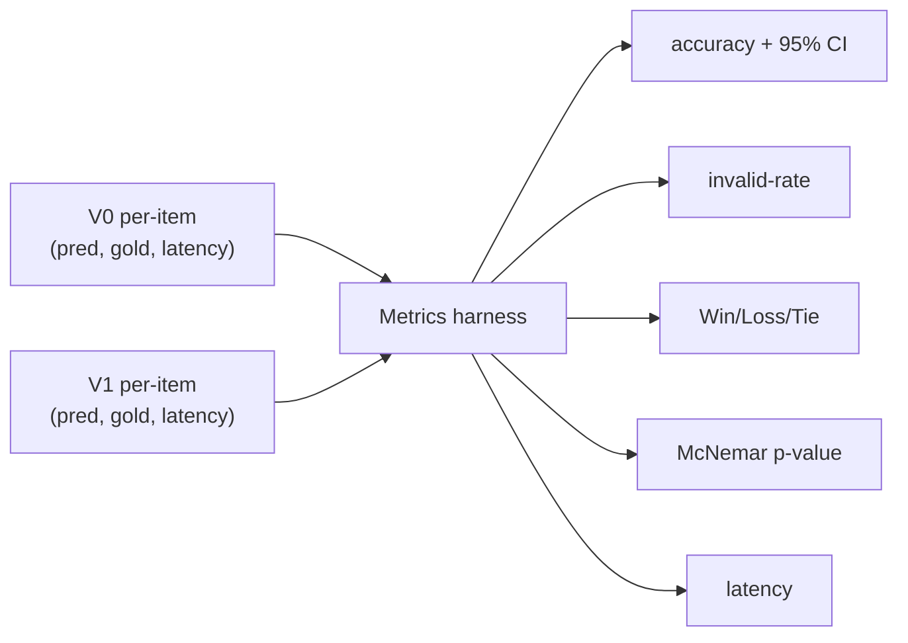

# Architecture — System Variants (V0–V4)

This document describes what is **built and measured today**: the five-variant ablation ladder
(V0 Direct LLM → V4 full multi-agent system), every component it uses, and **why** each was chosen.

Every variant is a **LangGraph `StateGraph`**, assembled from an internal `RunConfig` by
`graph/build.py:build_graph(cfg)`. All variants expose the same interface —
`answer(item: MCQItem) -> int | None` — and are selected through a single switch (`qa/variants.py`):

```python
from agent_hospital.qa import build_variant
answer = build_variant("V3", model="qwen2.5:14b")   # V0..V4
```



Each variant is a preset `RunConfig` (`qa/variants.py:_PRESETS`) compiled into a graph. Adding a
variant or A/B-testing a knob (model, embedder, panel size, verifier on/off) is a config change, not
new code, and every variant is evaluated identically. `RunConfig` is internal;
`build_variant(id, model=, temperature=, **overrides)` is the public surface.

---

## Shared infrastructure

| Piece | What | File |
|---|---|---|
| **Agent** | thin lazy wrapper over LangChain v1 `create_agent`; builds the graph on first use | `agents/base.py` |
| **Model access** | any `BaseChatModel`; a bare string → local `ChatOllama` (provider-agnostic) | `agents/base.py` |
| **Config** | `RunConfig` (answer role, rag, panel_size, aggregate, verify, per-role models) + `RagConfig` | `config.py` |
| **Roles** | `ROLE_PROMPTS` registry — baseline · rag-answerer · specialist · attending · verifier | `roles.py` |
| **Graph** | `QAState` + node factories (reason/retrieve/answer/panel/aggregate/verify) + `build_graph(cfg)` | `graph/` |
| **Variant switch** | `_PRESETS` (V0–V4) + `build_variant(id, model, **overrides)` → uniform `answer` fn | `qa/variants.py` |
| **Eval harness** | per-item records → accuracy+CI, invalid-rate, Win/Loss/Tie, McNemar, latency | `qa/metrics.py` |
| **Data** | `nnilayy/medqa-usmle` (4-option MCQ; train 10,178 / val 1,272 / test 1,273) | `diseases/medqa_usmle.py` |

**Why this shape:** the goal is an **ablation ladder** — every variant differs by *exactly one thing*
and is scored the same way, so accuracy differences are attributable. A single config-driven graph
builder + one metrics harness guarantees that: V0→V1 adds RAG, V1→V2 swaps the answer role, V2→V3 adds
the panel/attending/verifier, V3→V4 drops the verifier.

### MedQA-USMLE row schema (`nnilayy/medqa-usmle`)

Each row is one 4-option MCQ in a SWAG-style schema:

| Field | Type | Holds |
|---|---|---|
| `id` | string | unique question id |
| `sent1` | string | clinical vignette **+** question stem (the full prompt; no separate question field) |
| `sent2` | string | secondary SWAG stem — unused here (constant/empty) |
| `ending0..3` | string | the four options (A–D) |
| `label` | int 0–3 | index of the correct option |

Cached locally as Arrow files (`~/.cache/huggingface/datasets/nnilayy___medqa-usmle/`), memory-mapped by
`datasets`. Our loader (`diseases/medqa_usmle.py`) maps each row → `MCQItem`:
`sent1 → question`, `[ending0..3] → options`, `label → answer_idx`; `sent2` is dropped. Splits:
train 10,178 / validation 1,272 / test 1,273.

---

## V0 — Direct LLM (the control)


- **No retrieval, no reasoning, no panel** — the graph is a single `answer` node (`answer_role="baseline"`,
  `rag=None`); `build_graph` wires only `START → answer → END`.
- Prompt = vignette + four options + "respond with only the letter" (`roles.py:BASELINE`, `qa/mcq.py:format_mcq`).
- `parse_choice` extracts A–D (`Answer: X`, else a lone letter); unparseable → `None` (an invalid
  response, never a silent wrong).

**Why it exists:** it is the **baseline every other variant is measured against**. Accuracy gain is
`Acc(Vn) − Acc(V0)`, so V0 must be the purest possible single-call LLM with no extras.

---

## V1 — RAG-only

V1 = V0 **plus** retrieved textbook evidence: a knowledge base built once offline, then per-question
retrieval at inference.



Files: `knowledge/ingest.py` (streamed incremental embedding), `knowledge/embeddings.py` (embedder
seam), `knowledge/retriever.py` (`open_store`, gated `retrieve`), `qa/reasoning.py` (query distiller),
`graph/nodes.py` (`make_reason_node`, `make_retrieve_node`, `make_answer_node`). V1's answer role is
`rag-answerer`; V2 swaps it for `specialist` — the only difference between them.

---

## V2–V4 — Multi-agent

V2–V4 share the same front end as V1 (`reason → retrieve`) and differ in how the answer is produced.
All roles/prompts live in `roles.py`; all nodes in `graph/nodes.py`; the wiring is `graph/build.py`.



- **V2 — single specialist:** `answer_role="specialist"` — one clinician-framed answerer over the same
  evidence. This is the first variant that beat V1 significantly (p=0.023); the lift is *reasoning*, not RAG.
- **V3 — full system:** a **panel** of `panel_size=2` specialists, each given a distinct perspective
  (`roles.PERSPECTIVES`: "favor the single most likely answer" vs "rule out dangerous/confused
  alternatives") so a temperature-0 panel still produces diverse opinions; an **attending** aggregates
  them (`aggregate=True`); a **verifier** does a final confirm/revise pass (`verify=True`). Parse failure
  at any late stage keeps the prior answer rather than emitting `None`.
- **V4 — full system without verifier:** identical to V3 with `verify=False` — isolates the verifier's
  contribution (V3 − V4 = the verifier's marginal effect).

> **Note — experience/memory base not built.** Earlier plans framed V3 around retrieving rationales from
> solved MedQA-train mistakes. That was descoped; the built V3 gets its gain from a diverse-perspective
> panel + attending + verifier, with no episodic-memory retrieval. An experience base remains future work.

---

## Component choices & rationale

| Component | Choice | Why this choice |
|---|---|---|
| **RAG source / corpus** | **MedRAG Textbooks** — 18 USMLE textbooks, **125,847** pre-chunked snippets | **Leakage-safe** (reference text, not exam Q/A); the **exam is written against these books**, matching the query distribution; open + **pre-chunked**. PubMed/Wikipedia rejected — ~24–30M snippets, too big to embed locally. |
| **Chunking** | MedRAG snippets **as-is** | already chunked by the authors; avoids re-chunking guesswork now. |
| **Embedding model** | **`nomic-embed-text`** (Ollama, 768-d, local) | fully local/free, no extra deps, same stack as the user's obsidian-rag. **MedCPT** (medical-tuned) was first pick but its HF download **hard-stalled (0 MB/s)** → dropped; kept as a one-line swap via `knowledge/embeddings.py:default_embeddings()`. |
| **Vector store** | **Chroma**, persistent, **cosine (HNSW)** | local, no server, native LangChain integration; cosine space set explicitly so relevance scores feed the gate. |
| **Retrieval algorithm** | **dense VSM** — cosine, **top-k = 4**, **similarity gate ≥ 0.5 + no-RAG fallback** | dense captures clinical **paraphrase/synonyms** sparse misses; the **gate** stops off-topic snippets degrading answers (RAG was **−8 pts** without a sharp query/gate); k=4 balances evidence vs context bloat. Sparse/BM25 + **hybrid** are documented future options. |
| **Query strategy** | **LLM query distillation** (retrieve on the focused question, not the raw vignette) | whole-vignette retrieval pulled **topical-but-non-discriminating** passages → **−8 pts**; distillation **flipped the lift to +2 pts**. |
| **Answering LLM** | **`qwen2.5:14b`** (Ollama, tool-calling) | best **capability/speed** on a 48 GB Mac; **32B gave no gain** (0.66 vs 0.68) at ~4× latency; 7B is the cheap baseline. Swappable via `build_variant(model=…)`. |
| **Scoring** | exact **MCQ option match** vs `label`; `None` = invalid | MedQA answers vary (dx/treatment/next-step), so the unit is "pick the right option", not a diagnosis string. |

---

## Knowledge base deep-dive — MedRAG

**MedRAG** (Xiong et al., 2024, *Benchmarking RAG for Medicine*) bundles three things: a corpus
collection ("MedCorp"), the **MIRAGE** benchmark, and a retrieval toolkit.

**Corpora (MedCorp):**

| Corpus | Scale | Content | Local-friendly |
|---|---|---|---|
| **Textbooks** | 18 USMLE books, **~125,847** snippets | exam-aligned reference | ✅ **we use this** |
| StatPearls | ~9,330 articles (chunked) | clinical point-of-care | ✅ feasible |
| PubMed | ~23.9M snippets | biomedical abstracts | ❌ too big locally |
| Wikipedia | ~29.9M snippets | general knowledge | ❌ too big locally |

Each ships on HuggingFace pre-chunked (`id, title, content, contents`); we index `content`. We use
**Textbooks only** — leakage-safe (reference text, not exam Q/A), USMLE-aligned, and small enough to
embed locally.

**MIRAGE** — a 5-dataset medical-QA benchmark (incl. MedQA, MedMCQA, PubMedQA, BioASQ, MMLU-Med).
**Role in our app: reference only.** We run our own harness on MedQA-USMLE (one MIRAGE dataset), not
MIRAGE itself; adopting the others later would show where RAG helps more.

**Our embeddings vs MedRAG's precomputed embeddings:**

| | MedRAG precomputed | Ours |
|---|---|---|
| Who embeds | MedRAG authors, shipped ready | we embed at ingest |
| Model | MedCPT / Contriever / SPECTER (some **medical-tuned**) | `nomic-embed-text` (general) |
| Cost | download vectors, no compute | we embed 125k snippets ourselves |
| Index | their format/retriever | our **Chroma** (cosine + gate) |

Vectors are **not interchangeable across models** (a `nomic` doc vector and a MedCPT query vector are in
different spaces). We re-embedded locally with `nomic` because MedCPT's download stalled; the main thing
given up is MedCPT's domain tuning.

**Why RAG barely helped MedQA (the key insight):** RAG gains are **uneven across datasets**.
Lookup-heavy sets (PubMedQA, BioASQ) benefit strongly; **reasoning/recall sets like MedQA barely do**,
because a strong model already encodes the textbook knowledge and the work is *reasoning*, not
fact-fetching. **This is exactly why our V1−V0 was a flat +2 pts (n.s.)** — MedQA is the reasoning kind,
the hardest case for retrieval. It also points the next lever at **reasoning** (a reasoning agent that
forms a sharper query, then the multi-agent pipeline), not more retrieval.

**MedCPT (revisiting):** MedRAG's strongest, medical-domain-tuned retriever — an asymmetric bi-encoder
(separate query/article encoders). Being retried as a drop-in via `knowledge/embeddings.py`; if it
loads, re-embed Textbooks with the article encoder and retrieve with the query encoder.

## Evaluation

- **Set:** 150 MedQA-USMLE **test** items (held out; train/val never scored).
- **Metrics (one per-item pass, `qa/metrics.py`):** accuracy + **95% bootstrap CI**, **invalid-rate**,
  **Win/Loss/Tie**, **McNemar** (exact paired test), **mean latency**.
- **Why these:** accuracy alone is a point estimate; **McNemar** (paired, same items) answers *"is the
  gain real?"* and the **bootstrap CI** bounds it; invalid-rate guards against parsing artifacts.



### Measured results (qwen2.5:14b, **temperature=0**, 80 test items)

| | V0 — Direct LLM | V1 — RAG-only | V2 — Multi-agent |
|---|---|---|---|
| Accuracy | 0.662 | 0.625 | **0.738** |
| 95% bootstrap CI | [0.562, 0.762] | [0.525, 0.725] | [0.637, 0.825] |
| Invalid rate | 0.0% | 0.0% | 0.0% |
| Latency / item | 0.63 s | 2.84 s | 7.35 s |

| Pairing | gain | Win/Loss/Tie | McNemar p |
|---|---|---|---|
| V1 vs V0 | −3.7 pts | 7 / 10 / 63 | 0.63 (n.s.) |
| V2 vs V0 | +7.5 pts | 10 / 4 / 66 | 0.18 (n.s.) |
| **V2 vs V1** | **+11.3 pts** | **11 / 2 / 67** | **0.023 (significant)** |

**Interpretation:**
- **Single-agent RAG (V1) does not help** — again slightly *below* V0 (also seen at 150 items: 0.727 vs
  0.720). Retrieval is not the lever on MedQA (reasoning-heavy, not lookup).
- **Multi-agent (V2) is the first real gain** — top accuracy (0.738), and its win over **V1 is
  statistically significant (p=0.023)**. The gain comes from the reasoner→specialist reasoning, not RAG.
- **V2 vs V0 = +7.5 pts but not yet significant (p=0.18)** at n=80 (small-sample; V0 here is 0.662 vs
  0.72 on the 150-set) — promising, to be confirmed at larger n.

**V3/V4 status:** built and functionally verified end-to-end (graph runs, 0 invalid), but **not yet
measured at n ≥ 80**. The scale run of V3 (panel+attending+verifier) and V4 (no verifier) — plus V3 vs V4
to isolate the verifier — is the next evaluation step.

---

## Design principles

1. **One-thing-at-a-time ablation** — V0→V1 differs only by RAG, so +2 pts is attributable to RAG.
2. **Everything is a swap-point** — embedder, model, retrieval params — change one, re-measure cheaply.
3. **Leakage discipline** — corpus = textbooks (never exam items); only the held-out test split is scored.
4. **Honest measurement** — paired significance (McNemar) + CIs, not bare accuracy.
