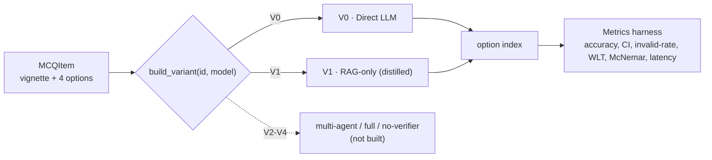
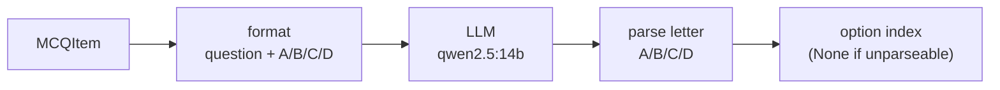
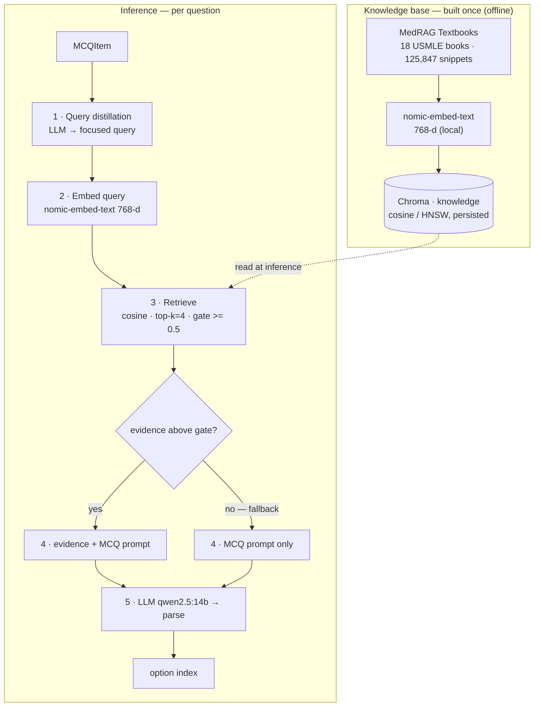
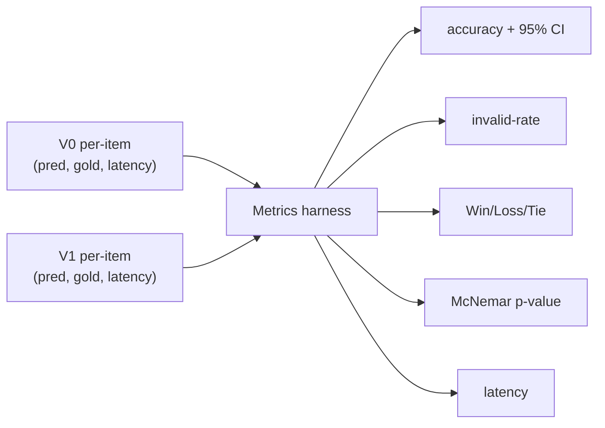

# Architecture — System Variants (V0 & V1)

This document describes what is **built and measured today**: the two answer-only variants
(V0 Direct LLM, V1 RAG-only), every component they use, and **why** each was chosen.
Variants V2–V4 (multi-agent, full system, no-verifier) are registered placeholders, not yet built.

All variants expose the same interface — `answer(item: MCQItem) -> int | None` — and are selected
through a single switch (`qa/variants.py`):

```python
from agent_hospital.qa import build_variant
answer = build_variant("V0", model="qwen2.5:14b")   # or "V1"
```



`build_variant` is the only place a variant is wired, so adding V2–V4 or swapping a model is a
one-line change and every variant is evaluated identically.

---

## Shared infrastructure

| Piece | What | File |
|---|---|---|
| **Agent** | thin lazy wrapper over LangChain v1 `create_agent`; builds the graph on first use | `agents/base.py` |
| **Model access** | any `BaseChatModel`; a bare string → local `ChatOllama` (provider-agnostic) | `agents/base.py` |
| **Variant switch** | `build_variant(id, model, **kw)` → uniform `answer` fn | `qa/variants.py` |
| **Eval harness** | per-item records → accuracy+CI, invalid-rate, Win/Loss/Tie, McNemar, latency | `qa/metrics.py` |
| **Data** | `nnilayy/medqa-usmle` (4-option MCQ; train 10,200 / val 1,270 / test 1,270) | `diseases/medqa_usmle.py` |

**Why this shape:** the goal is an **ablation ladder** — every variant differs by *exactly one thing*
and is scored the same way, so accuracy differences are attributable. One switch + one metrics harness
guarantees that.

### MedQA-USMLE row schema (`nnilayy/medqa-usmle`)

Each row is one 4-option MCQ in a SWAG-style schema:

| Field | Type | Holds |
|---|---|---|
| `id` | string | unique question id |
| `sent1` | string | clinical vignette **+** question stem (the full prompt; no separate question field) |
| `sent2` | string | secondary SWAG stem — unused here (constant/empty) |
| `ending0..3` | string | the four options (A–D) |
| `label` | int 0–3 | index of the correct option |

Cached locally as Arrow files (`~/.cache/huggingface/datasets/nnilayy___medqa-usmle/`), memory-mapped by
`datasets`. Our loader (`diseases/medqa_usmle.py`) maps each row → `MCQItem`:
`sent1 → question`, `[ending0..3] → options`, `label → answer_idx`; `sent2` is dropped. Splits:
train 10,178 / validation 1,272 / test 1,273.

---

## V0 — Direct LLM (the control)



- **No retrieval, no agents, no memory** (`qa/baseline.py` imports only `Agent` + `MCQItem` — verified
  no `retrieve`/`knowledge`/store reference on this path).
- Prompt = vignette + four options + "respond with only the letter".
- `parse_choice` extracts A–D (`Answer: X`, else a lone letter); unparseable → `None` (an invalid
  response, never a silent wrong).

**Why it exists:** it is the **baseline every other variant is measured against**. Accuracy gain is
`Acc(Vn) − Acc(V0)`, so V0 must be the purest possible single-call LLM with no extras.

---

## V1 — RAG-only

V1 = V0 **plus** retrieved textbook evidence: a knowledge base built once offline, then per-question
retrieval at inference.



Files: `knowledge/ingest.py` (streamed incremental embedding), `knowledge/embeddings.py` (embedder
seam), `knowledge/retriever.py` (`open_store`, gated `retrieve`), `qa/rag_answer.py` (distiller + answerer).

---

## Component choices & rationale

| Component | Choice | Why this choice |
|---|---|---|
| **RAG source / corpus** | **MedRAG Textbooks** — 18 USMLE textbooks, **125,847** pre-chunked snippets | **Leakage-safe** (reference text, not exam Q/A); the **exam is written against these books**, matching the query distribution; open + **pre-chunked**. PubMed/Wikipedia rejected — ~24–30M snippets, too big to embed locally. |
| **Chunking** | MedRAG snippets **as-is** | already chunked by the authors; avoids re-chunking guesswork now. |
| **Embedding model** | **`nomic-embed-text`** (Ollama, 768-d, local) | fully local/free, no extra deps, same stack as the user's obsidian-rag. **MedCPT** (medical-tuned) was first pick but its HF download **hard-stalled (0 MB/s)** → dropped; kept as a one-line swap via `knowledge/embeddings.py:default_embeddings()`. |
| **Vector store** | **Chroma**, persistent, **cosine (HNSW)** | local, no server, native LangChain integration; cosine space set explicitly so relevance scores feed the gate. |
| **Retrieval algorithm** | **dense VSM** — cosine, **top-k = 4**, **similarity gate ≥ 0.5 + no-RAG fallback** | dense captures clinical **paraphrase/synonyms** sparse misses; the **gate** stops off-topic snippets degrading answers (RAG was **−8 pts** without a sharp query/gate); k=4 balances evidence vs context bloat. Sparse/BM25 + **hybrid** are documented future options. |
| **Query strategy** | **LLM query distillation** (retrieve on the focused question, not the raw vignette) | whole-vignette retrieval pulled **topical-but-non-discriminating** passages → **−8 pts**; distillation **flipped the lift to +2 pts**. |
| **Answering LLM** | **`qwen2.5:14b`** (Ollama, tool-calling) | best **capability/speed** on a 48 GB Mac; **32B gave no gain** (0.66 vs 0.68) at ~4× latency; 7B is the cheap baseline. Swappable via `build_variant(model=…)`. |
| **Scoring** | exact **MCQ option match** vs `label`; `None` = invalid | MedQA answers vary (dx/treatment/next-step), so the unit is "pick the right option", not a diagnosis string. |

---

## Evaluation

- **Set:** 150 MedQA-USMLE **test** items (held out; train/val never scored).
- **Metrics (one per-item pass, `qa/metrics.py`):** accuracy + **95% bootstrap CI**, **invalid-rate**,
  **Win/Loss/Tie**, **McNemar** (exact paired test), **mean latency**.
- **Why these:** accuracy alone is a point estimate; **McNemar** (paired, same items) answers *"is the
  gain real?"* and the **bootstrap CI** bounds it; invalid-rate guards against parsing artifacts.



### Measured results (qwen2.5:14b, 150 items)

| | V0 — Direct LLM | V1 — RAG-only (distilled) |
|---|---|---|
| Accuracy | 0.720 | **0.740** |
| 95% bootstrap CI | [0.647, 0.793] | [0.673, 0.807] |
| Invalid rate | 0.0% | 0.0% |
| Latency / item | 0.59 s | 6.43 s |

| Paired V1 vs V0 | value |
|---|---|
| Accuracy gain | **+2.0 pts** |
| Win / Loss / Tie | 14 / 11 / 125 |
| McNemar (wins, losses, p) | 14, 11, **p = 0.69** |

**Interpretation:** distillation removed RAG's harm (−8 → +2 pts), but **+2 pts is not statistically
significant** (p = 0.69) and V1 costs **~11× the latency**. Conclusion: **single-agent RAG does not move
the needle** here with a 14B model — real gains must come from the **multi-agent pipeline (V2/V3)** or
the **experience base**, not single-reasoner retrieval.

---

## Design principles

1. **One-thing-at-a-time ablation** — V0→V1 differs only by RAG, so +2 pts is attributable to RAG.
2. **Everything is a swap-point** — embedder, model, retrieval params — change one, re-measure cheaply.
3. **Leakage discipline** — corpus = textbooks (never exam items); only the held-out test split is scored.
4. **Honest measurement** — paired significance (McNemar) + CIs, not bare accuracy.
