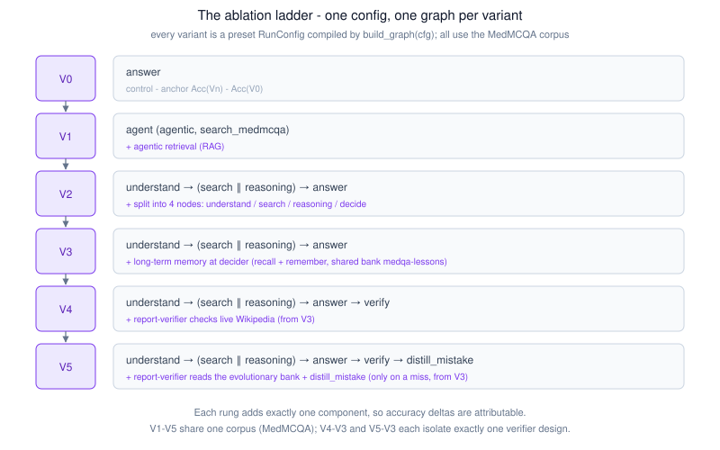
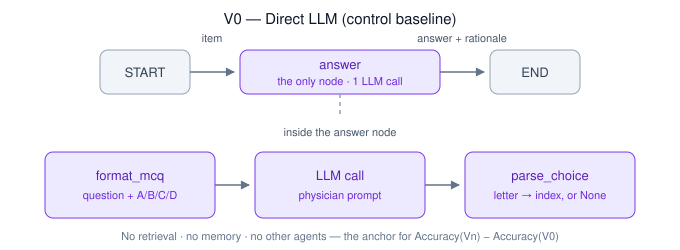
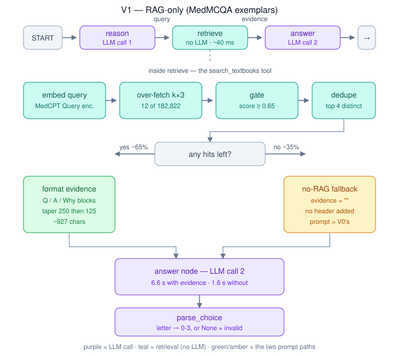
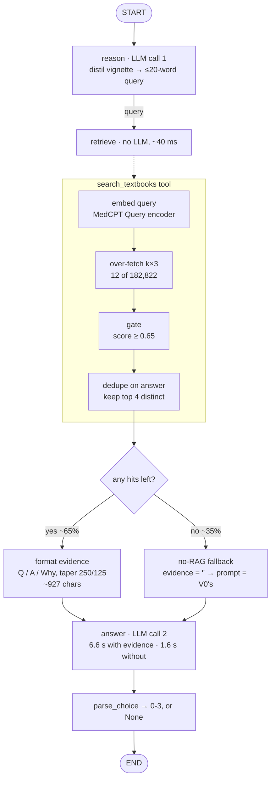
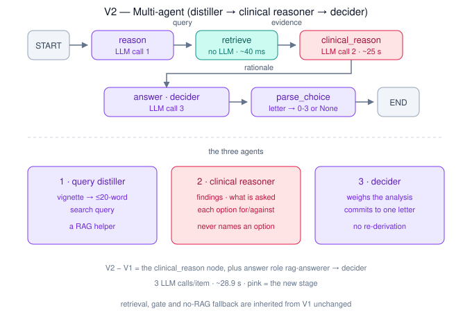

# Report Notes

Working notes for the midterm report, organised against the required report structure.
Sections are filled in as each variant is built. **Status: architecture + V0 + V1 + V2 complete.**

> **§3b/§3c below describe the pre-rebuild V1/V2 design** (graph-invoked textbook/MedMCQA retrieval,
> clinical-reasoner + decider) — V1 and V2 were since rebuilt as agentic MedAgents-style panels (see
> `ARCHITECTURE.md`). `report.tex` is the up-to-date, authoritative write-up of the current design;
> treat this file's variant-design sections as superseded working notes, not current documentation.

Companion docs: [ARCHITECTURE.md](ARCHITECTURE.md) (what is wired to what) ·
[TECHNICAL_DECISIONS.md](TECHNICAL_DECISIONS.md) (why, with evidence) ·
[diagrams/](diagrams/) (report-ready SVGs).

---

## 2. System Architecture



### The organising idea
Every variant is the **same graph skeleton with different nodes switched on**. A variant is
not a separate code path — it is a preset `RunConfig` compiled into a LangGraph `StateGraph`
by `build_graph(cfg)`. This is what makes the ablation honest: V0→V1 differs by exactly the
RAG nodes, V2→V3 by exactly the panel/attending/verifier, V3→V4 by exactly the verifier.

```
[reason → retrieve] → (answer | panel → aggregate) → [verify]
```

| variant | nodes actually wired | agents |
|---|---|---|
| V0 | `answer` | 1 |
| V1 | `reason → retrieve → answer` | 2 |
| V2 | `reason → retrieve → clinical_reason → answer` | 3 |
| V3 | `reason → retrieve → panel → aggregate → verify` | 5 |
| V4 | `reason → retrieve → panel → aggregate` | 4 |

### Module map
| module | responsibility |
|---|---|
| `config.py` | `RunConfig` / `RagConfig` — the only flexibility surface |
| `roles.py` | `ROLE_PROMPTS` registry — every system prompt lives here |
| `graph/state.py` | `QAState` — `item`, `query`, `evidence`, `rationale`, `opinions`, `answer` |
| `graph/nodes.py` | node factories, one per pipeline stage |
| `graph/build.py` | `build_graph(cfg)` — assembles + compiles the graph |
| `qa/variants.py` | `_PRESETS` (V0–V4) + `build_variant()` — the public switch |
| `qa/mcq.py` | `format_mcq` (prompt) + `parse_choice` (answer extraction) |
| `qa/metrics.py` | `EpisodeRecord` + all metrics (accuracy, CI, WLT, McNemar, latency) |
| `models.py` | `resolve_model` — `provider:model` → chat model |
| `knowledge/` | RAG: ingest · embeddings · retriever |
| `agents/base.py` | `Agent` — lazy `create_agent` wrapper, provider-agnostic |

### Design properties worth stating in the report
- **Laziness** — agents build on first call, the Chroma store opens on first retrieval. Compiling
  a graph touches no network, so tests and graph construction are offline-safe.
- **Uniform interface** — every variant is `answer(item) -> int | None`, so one metrics harness
  scores all of them identically.
- **Behaviour-preservation gate** — `tests/test_golden.py` replays captured answers and asserts
  byte-identical results. It currently pins **nothing**: every variant changed intentionally
  (MedMCQA corpus, clinical reasoner, reason-then-answer prompts), so the old captures expired.
  Re-capture once the ladder settles.

---

## 3. System Design — V0 (Direct LLM baseline)



### Purpose
The **control**. Every reported gain is `Accuracy(Vn) − Accuracy(V0)`, so V0 must be the purest
possible single-call LLM: no retrieval, no memory, no second agent, no tools. Its only input is
the question itself.

### Configuration
```python
RunConfig(answer_role="baseline", rag=None,
          panel_size=1, aggregate=False, verify=False)
```
`rag=None` skips reason/retrieve; `panel_size==1 and not aggregate` selects the single `answer`
node; `verify=False` adds nothing after. Compiled graph: **`START → answer → END`** (one node).

### Prompt (verbatim — required for §10 reproducibility)
System prompt (`roles.py:BASELINE`):
> You are an expert physician answering a medical board (USMLE) multiple-choice question.
> Choose the single best answer, with a brief justification.

User turn (`qa/mcq.py:format_mcq`):
```
{question}

A. {option 0}
B. {option 1}
C. {option 2}
D. {option 3}

Reason briefly, then on the LAST line write 'Answer: X' where X is A, B, C, or D.
```
(V0 was letter-only until §3's explanation requirement was implemented; that change
invalidated the earlier 200-item numbers.) No evidence is prepended — `_prompt()` finds `state["evidence"]` empty because no retrieve node ran.

### Answer extraction
`parse_choice` tries `Answer: X` / `answer is X` (case-insensitive), then falls back to the first
standalone `A|B|C|D`. Returns index `0–3`, or `None` = **invalid** (never a silent wrong).
The `Answer: X` pattern catches the reason-then-answer replies — **invalid rate 0.0%** throughout.

### Execution, condensed
```python
agent  = Agent("baseline", BASELINE, model=resolve_model(spec, temperature=0))
reply  = agent.say(format_mcq(item, REASON_THEN_ANSWER))   # one LLM call, no tools
answer = parse_choice(reply)                                # rationale = reply
```
`QAState` carries `item` in, `answer` + `rationale` out; `query` / `evidence` / `opinions` unset.

---

## 3b. System Design — V1 (RAG)



### Graph
`START → reason → retrieve → answer → END`. V1 = V0 plus retrieval; the only new `QAState` fields are
`query` and `evidence`, plus the answer role changes `baseline → rag-answerer`.



| node | what it does | cost |
|---|---|---|
| `reason` | reasoning agent distils the vignette into a ≤20-word search query | **LLM call 1**, 0.5–1.8 s |
| `retrieve` | `search_textbooks` tool: embed → over-fetch → gate → dedupe → format | **no LLM**, 0.03–0.06 s |
| `answer` | evidence prepended to the MCQ prompt, letter parsed out | **LLM call 2**, 0.5–10 s |

### Retrieval configuration
| setting | value |
|---|---|
| corpus | **MedMCQA** — 182,822 solved exam questions (Pal et al., CHIL 2022) |
| collection | `knowledge_medmcqa` (Chroma, cosine/HNSW) |
| embedder | **MedCPT** (asymmetric: Article encoder for docs, Query encoder for queries) |
| what is embedded | **the question only** — answer/explanation/subject are metadata |
| top-k | 4 distinct (over-fetch 12, dedupe on answer text) |
| **gate threshold** | **0.65** |
| evidence format | `Q: … / A: … / Why: …`, explanation tapered 250 chars (rank 0) then 125 |
| fallback | no hits above gate → `evidence=""` → prompt collapses to V0's shape |

**V2 inherits this corpus and gate unchanged**, so `V2 − V1` isolates the answering stage. V3/V4 still
retrieve **textbook prose** (`knowledge_medcpt`, gate 0.60), so `V2 → V3` confounds corpus with
architecture — resolve before the ladder goes in the report.

### Why the corpus changed from textbooks to MedMCQA
Textbook RAG measurably **hurt** (V1 0.625 vs V0 0.662), and the published literature reports the same:
textbook-corpus retrieval gives no significant gain on USMLE because the items are reasoning-driven —
the answer is *derived* from integrating findings, not stated in any one passage. MedMCQA retrieves
*solved questions with their explanations* instead of expository prose — closer to Medprompt's exemplar
retrieval, which reached 90.6% on MedQA. **Not yet measured on our system.**

### Why retrieval is a tool but not agent-driven
`search_textbooks` is defined once as a `@tool`, then **invoked by the retrieve node** rather than chosen
by the model. Measured both ways (D19): agent-driven costs 3 LLM calls / 542 generated chars / 3.78 s;
graph-invoked costs 2 / 51 / 0.90 s. A model-chosen tool call needs a second invocation to consume the
result, and a tool-using agent cannot be told "respond with ONLY the letter". The tool stays bindable to
an agent, so agentic RAG remains a one-line change.

### Why the gate is 0.65
Calibrated on 20 real distilled queries against this collection:

| gate | hits kept | queries with ≥1 hit |
|---|---|---|
| 0.60 | 84% | 85% |
| **0.65** | **65%** | **65%** ← chosen |
| 0.70 | 16% | 25% |

0.65 matches the textbook gate's selectivity (~65%), so the corpus A/B is not confounded by one gate
firing more often than the other. Above ~0.70 V1 degenerates toward V0 (75%+ of items take the fallback).
**Thresholds do not transfer between embedders or corpora** — MedCPT is asymmetric so scores top out
≈0.74; a 0.9 gate would admit nothing at all.

**Caveat:** the gate is a *speed* knob, not a proven *quality* knob. Scores cluster tightly (0.583–0.742),
so the margin between a good and a mediocre hit is ~0.05, and cosine measures topical closeness rather
than whether the passage resolves the question. A threshold sweep (0.60/0.65/0.70) is still unrun.

### Latency profile — V1 is bimodal
The gate splits V1 into two systems (qwen2.5:14b, 12 train items):

| path | share | mean | why |
|---|---|---|---|
| evidence retrieved | ~65% | **6.56 s** | ~900 extra chars to prefill |
| gate rejected all | ~35% | **1.62 s** | prompt identical to V0's |

All variance is in the `answer` node; `retrieve` is ~0.6% of runtime. Expected cost ≈ 4.85 s/item.

**Dedupe + taper** halved evidence (1,890 → 927 chars) but cut latency only 17% (7.90 → 6.56 s), and the
per-item effect was erratic — one item with just 375 chars of evidence still took 7.9 s. So **crossing
from no-evidence to any-evidence dominates, not evidence size** (likely prompt-cache behaviour). Dedupe
is kept regardless: it is a pure information win (4 distinct hits instead of ~2 facts twice).

## 3c. System Design — V2 (multi-agent)



### Graph
`START → reason → retrieve → clinical_reason → answer → END`. Inherits V1's entire front end
byte-identically, so **V2 − V1 is attributable to the answering stage alone**.

| # | agent | role | output |
|---|---|---|---|
| 1 | `reasoner` | distils the vignette into a search query | `query` |
| — | *(retrieve — tool, no LLM)* | gated MedMCQA retrieval | `evidence` |
| 2 | **`clinical-reasoner`** | key findings → what is asked → each option for/against | `rationale` |
| 3 | **`decider`** | weighs the analysis, commits to a letter | `answer` |

**3 agents, 3 LLM calls/item** — satisfies §4.6 (≥3 agents) and §4.2 (medical reasoning agent).

### Why the reasoner may not name an option
`CLINICAL_REASONER` is instructed *"Do NOT choose an answer… Never write 'Answer:'"*, and the
user turn ends with `ANALYSE_ONLY` rather than the letter-only closing. If it named a letter the
decider would simply copy it and the split into two agents would buy nothing. **Verified: 0/10
answer leaks** on a smoke run; rationales ran 1,890–3,625 chars.

### Measured (smoke, qwen2.5:14b, 10 train items)
9/10 correct, 0 invalid, **28.9 s/item** — ~5× V1 and ~44× V0, because the reasoner generates
~2,500 chars and generation dominates latency. Not yet measured at scale; n=10 proves nothing.

---

## 3d. Answer + explanation (spec §3)

§3 requires *"exactly one final answer option plus a short explanation"*. Every variant returns
both, via a single interface:

```python
answer_fn(item) -> AnswerResult(answer: int | None, rationale: str)
```

`EpisodeRecord` carries the rationale too, so the metrics harness and (future) prediction files
have it without a second pass.

### Where each variant's explanation comes from
| variant | produced by | closing instruction |
|---|---|---|
| V0 | the single answerer | `REASON_THEN_ANSWER` (≤30 words) |
| V1 | the answerer, over retrieved evidence | `REASON_THEN_ANSWER` |
| V2 | the **decider** — a short justification of its own | `REASON_THEN_ANSWER` |
| V3 | the **verifier** (last node to write `answer`) | `REASON_THEN_ANSWER` |
| V4 | the **attending** | `REASON_THEN_ANSWER` |

### Three closings, because one instruction cannot serve every role
| constant | used by | text |
|---|---|---|
| `LETTER_ONLY` | default (kept for reference) | "Respond with ONLY the letter…" |
| `REASON_THEN_ANSWER` | every answering node | "In at most 30 words, say why the best option is best, then… 'Answer: X'" |
| `ANALYSE_ONLY` | V2's clinical reasoner | "Analyse the case and the options. Do NOT state a final answer." |
| `DELIBERATE` | V3/V4 panel | "Reason about the key findings and the options, then… 'Answer: X'" |

**Why the panel is exempt from the 30-word cap:** panel opinions are *internal* — they are the
attending's input, not user-facing output. Capping them would degrade the deliberation V3 exists
to test. Only the final answering node is constrained.

**Why V2's decider explains rather than passing the analysis through:** the clinical reasoner
emits ~2,000 chars, which is not "a short explanation". The analysis still drives the decision;
the decider writes the user-facing sentence.

### Cost
Explanations are not free. V0 went from **0.66 s → ~1.5 s/item** at 30 words (it was ~8.5 s when
replies ran ~200 words). Any comparison against the earlier letter-only numbers is invalid.

---

## 4. Experimental Setup

| item | value |
|---|---|
| Dataset | `openlifescienceai/medqa` (Jin et al. 2020) — train 10,178 / validation 1,272 / **test 1,273** |
| RAG corpus (V1) | `openlifescienceai/medmcqa` (Pal et al. 2022) — 182,822 items → `knowledge_medmcqa` |
| RAG corpus (V2–V4) | MedRAG Textbooks — 125,847 snippets → `knowledge_medcpt` |
| Dev split | `train` (debugging/tuning only) |
| Official split | `test`, n=1273 — the §7 denominator; used **once** |
| Default model | `qwen2.5:7b` (CLI default), `qwen2.5:14b` (library default) |
| Temperature | **0** everywhere (D16) — paired comparisons need determinism |
| Seed | `bootstrap_ci(seed=0)`; generation is greedy at temp=0 so no sampling seed applies |
| Hardware | Apple Silicon Mac, 48 GB unified memory, local Ollama |
| Providers | Ollama (local) or `anthropic:` / `openai:` / `google:` / `openrouter:` specs |

### Reproducing a run
```bash
HF_HUB_OFFLINE=1 PYTHONPATH=src .venv/bin/python -m agent_hospital -v V0 -n 150
```
Dataset is cached locally (`~/.cache/huggingface/datasets/`, 11 MB, all 3 splits) and loads with
no network — `HF_HUB_OFFLINE=1` just skips a slow metadata check that can 504.

---

## 5. Evaluation Results

### V0 vs V1 — 200 train items, qwen2.5:14b, temp=0 (letter-only prompts, now superseded)

| | accuracy | 95% CI | invalid | latency |
|---|---|---|---|---|
| V0 | 0.700 | [0.635, 0.770] | 0.0% | 0.66 s |
| V1 | 0.705 | [0.640, 0.770] | 0.0% | 5.58 s |

**V1 − V0 = +0.5 pts · W/L/T = 11/10/179 · McNemar p = 1.0000** — a null result at 8.5× the latency.
179/200 items were unaffected; of the 21 retrieval changed, it helped 11 and hurt 10.

Conditioning on whether the gate fired (168/200 items did): V1 scored **0.690 with evidence** vs
V0's **0.696 on those same items** — retrieval is inert, not merely weak. V1's higher score on the
32 no-evidence items (0.781) reflects those being easier questions, not a retrieval effect.

**Interpretation.** Both corpora now tested: textbooks −3.7 pts, MedMCQA +0.5 pts (n.s.). The
limitation is not the corpus — MedQA is reasoning-bound, not knowledge-bound. A 14B model already
holds the facts; retrieving more facts does not help it *integrate* them. This is the empirical
case for V2+ targeting reasoning structure rather than retrieval.

**Superseded:** these numbers predate the §3 explanation change (all variants now reason-then-answer),
so they must be re-measured before the report.

### V0 (historic)

Prior deterministic run (qwen2.5:14b, temp=0, 80 test items): **V0 accuracy 0.662**,
95% bootstrap CI [0.562, 0.762], invalid rate 0.0%, 0.63 s/item. On a 150-item run V0 measured
**0.72**. Full-test (n=1273) numbers are **not yet collected**.

---

## 6. Methodology gotchas (learned the hard way — worth a Limitations mention)

1. **Model spin-up must be excluded from latency.** A cold Ollama model charges the first item
   ~1.9 s vs ~0.3 s steady-state. The CLI now runs a **synthetic** warm-up item first.
2. **Warm up with a synthetic item, never a scored one.** Warming with `items[0]` left that exact
   prompt in Ollama's cache and made item 1 look *artificially fast* (0.2 s vs ~1.0 s neighbours) —
   a measurement artifact in the opposite direction.
3. **Check `ollama ps` before timing.** A leftover resident model (e.g. `qwen2.5:32b`, 28 GB
   alongside 7b on a 48 GB machine) causes GPU contention that inflated **every** latency ~2×.
   Stop non-target models before an official timed run.
4. **Latency is dominated by generated tokens, not prompt length.** V0's longest prompt (1233
   chars) was among the *fastest* items; all replies are 1 character.
5. **Cloud models weaken determinism.** temp=0 is set, but APIs don't guarantee reproducibility
   the way local greedy decoding does. Keep the golden gate pinned to a local model.
6. **A tool-using agent cannot be told "respond with ONLY the letter."** That instruction forbids any
   non-letter output, so the model emits **zero** tool calls (measured: 0/5 items). Allowing reasoning
   fixed it (1/1 tool calls) but grew output ~10× and latency 2.8×. Terse output and tool use are
   mutually exclusive.
7. **Gate thresholds are embedder-specific.** MedCPT tops out ≈0.69 because it is asymmetric; a
   threshold borrowed from another embedder can silently disable retrieval entirely.
8. **Retrieval is not the bottleneck.** The whole retrieve step is ~22 ms (~1.5% of V1 latency);
   cosine search over 125,847 vectors is sub-millisecond. Cost lives in token generation.
9. **A user-turn instruction silently overrides the system prompt.** Hit three times: (a) a
   tool-using agent under "respond with ONLY the letter" emitted **0/5** tool calls; (b) the
   clinical reasoner would have been told both to analyse and to answer; (c) V3's panel agents
   were told "Reason briefly" by their system prompt but "ONLY the letter" by the user turn — so
   the panel emitted **bare letters and never actually deliberated** (opinions 0 → ~2,500 chars
   once fixed). Any node whose system prompt asks for reasoning must pass a matching closing.
10. **Gate hit-rate drifts from calibration.** Calibrated at 65% on 20 queries; the 200-item run
   fired on **84%** (168/200). Small calibration samples under-estimate hit rate.

---

## 7. Known gaps vs the spec (as of V0)

| spec § | gap |
|---|---|
| §3 | Output is an option index only — **no explanation** is captured or returned |
| §4.4/4.5 | **Short-term and long-term memory not built** (so current V3 ≠ spec's "full system") |
| §7 | **No cost/token tracking** (latency only) |
| §8 | No **error-analysis** table or tooling |
| §9 | No **prediction files**; CLI reports metrics but doesn't dump per-item predictions |
| §5 | Full **test-set (1273) run** not yet done |
| §12 | Report and slides not started |
